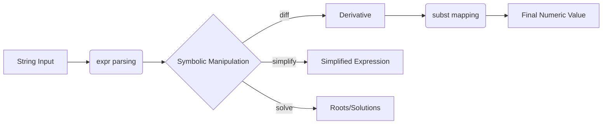

# 🧠 AI & Symbolic Reasoning in Fiber

Higher-order reasoning in Fiber is powered by a hybrid architecture that blends the abstract beauty of **Symbolic Logic** with the brute-force efficiency of **Numerical Tensors**.

## 🔄 The Reasoning Pipeline

Fiber uses a multi-stage pipeline to transform abstract mathematical intent into concrete numerical results.



## 1. Symbolic core (SymPy)

Perform exact mathematical operations without rounding errors or loss of precision.

| Operation | Syntax | Logic |
| --- | --- | --- |
| **Parsing** | `expr("x^2")` | Converts text to a symbolic object. |
| **Differentiation** | `diff(e, "x")` | Calculates the formal derivative. |
| **Equation Solving**| `solve(e, "x")` | Returns instances where `e = 0`. |
| **Simplification** | `simplify(e)` | Algebraically reduces the expression. |

### Advanced Example: Finding Minima
```fiber
var e = expr("x^2 - 4*x + 4")
var de = diff(e, "x")  # 2*x - 4

# Solve for gradient = 0 to find the minimum
var critical_pts = solve(de, "x") 
print "Minimum found at x = " + str(critical_pts[0])
```

---

## 2. Numerical Tensor Stack (NumPy)

When you are ready to compute batches or interact with machine learning datasets, transition to Fiber Tensors.

### The `subst` Bridge
The `subst` (Substitute) builtin is the link between the two engines. It takes a dictionary of values and injects them into a symbolic expression.

```fiber
var velocity = expr("a * t")
var val = subst(velocity, {"a": 9.8, "t": 2.5})
print "Fall speed: " + str(val)
```

### Tensor Matrix Math
Fiber Tensors are thin, high-performance wrappers around NumPy arrays, providing operator overloading for natural syntax.

```fiber
var X = tensor([[1, 2], [3, 4]])
var W = tensor([[0.5, 0.1], [0.1, 0.5]])

# Natural Matrix Multiplication
var hidden = matmul(X, W)

# Element-wise operations
var bias = tensor([0.1, 0.1])
var activated = (hidden + bias) * 2
```

---

## 🚀 Future: Neural Graph Engine
Upcoming versions of Fiber will include a `Graph` object for native PyTorch/TensorFlow-like computation graphs, allowing for **Automatic Symbolic Differentiation** during training loops.
