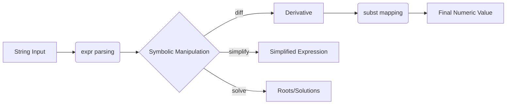

# 🧠 AI & Symbolic Reasoning in Fiber

Higher-order reasoning in Fiber is powered by a hybrid architecture that blends the abstract beauty of **Symbolic Logic** with the brute-force efficiency of **Numerical Tensors**.

## 🔄 The Reasoning Pipeline

Fiber uses a multi-stage pipeline to transform abstract mathematical intent into concrete numerical results.



## 1. Symbolic core (SymPy)

Perform exact mathematical operations without rounding errors or loss of precision.

| Operation | Syntax | Logic |
| --- | --- | --- |
| **Parsing** | `expr("x^2")` | Converts text to a symbolic object. |
| **Differentiation** | `diff(e, "x")` | Calculates the formal derivative. |
| **Equation Solving**| `solve(e, "x")` | Returns instances where `e = 0`. |
| **Simplification** | `simplify(e)` | Algebraically reduces the expression. |

### Finding Critical Points
```fiber
var e = expr("x^2 - 4*x + 4")
var de = diff(e, "x")  # 2*x - 4

var critical_pts = solve(de, "x") 
print "Minimum found at x = " + str(critical_pts[0])
```

---

## 2. The Neural Engine (PyTorch)

Fiber features a native **Neural Engine** with built-in automatic differentiation (Autograd). This allows you to build and train Machine Learning models directly in Fiber syntax.

### Trainable Tensors
Mark any tensor as trainable by passing `true` to the constructor.
```fiber
var weights = tensor([0.5, -0.1], true) # Tracks gradients
```

### Autograd Primitives
- **`backward(loss)`**: Triggers the reverse-mode auto-differentiation pass.
- **`grad(param)`**: Retrieves the calculated gradient for a parameter.
- **`zero_grad(param)`**: Resets the gradient buffer.

### High-Level Optimizers
Fiber provides managed optimizer objects to handle parameter updates automatically.

```fiber
var w = tensor([0.0], true)
var b = tensor([0.0], true)

# Support for "sgd" and "adam"
var opt = optimizer([w, b], "adam", 0.01)

# Inside training loop:
opt.zero_grad()
var loss = mse_loss(predict(x), target)
backward(loss)
opt.optimize()
```

---

## 3. Activation & Loss Functions

Native primitives for building layers:
- `relu(t)`: Rectified Linear Unit.
- `sigmoid(t)`: Logistic sigmoid.
- `mse_loss(pred, target)`: Mean Squared Error.
- `matmul(a, b)`: Matrix multiplication.

---

## 🚀 Advanced Use Case: Neuro-Symbolic Logic
Combine symbolic derivatives with neural training:
```fiber
var logic_expr = expr("w * x + b")
var symbolic_grad = diff(logic_expr, "w")

# Use symbolic logic to guide numerical updates
var w_val = 10.0
var guidance = subst(symbolic_grad, {"w": w_val, "x": 1.0})
# ... apply to neural weights ...
```
