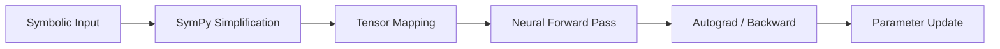

# 🧠 Neuro-Symbolic Integration in Fiber 0.3

Fiber 0.3 introduces a modular **Neural Engine** built on a symbolic-numerical bridge. This document explains how to combine high-level algebraic theory with low-level tensor computation.

---

## 1. Modular Neural API

The `lib/neural.fib` library provides a high-level API similar to PyTorch or Keras, but with first-class support for Fiber symbols.

### **The Layer Model**
Everything in Fiber's neural engine is a `Layer`. Layers manage their own `FiberTensor` parameters and handle forward propagation.

```fiber
from neural import Sequential, Linear, ReLU

# A modular MLP
var model = Sequential([
    Linear(784, 256),
    ReLU(),
    Linear(256, 10)
])

# Inference
var input = randn([1, 784])
var output = model.forward(input)
```

---

## 2. The Symbolic Bridge

The power of Fiber lies in using symbolic math to define or refine neural parameters.

### **Algebraic Weight Initialization**
You can use symbolic formulas to derive constants for your network:

```fiber
var derivation = expr("sqrt(2 / (fan_in + fan_out))")
var xavier_constant = subst(derivation, {"fan_in": 784, "fan_out": 256})

var weights = randn([784, 256]) * xavier_constant
```

---

## 3. Training & Optimization

### **High-Level Optimizers**
Use the `optimizer` built-in to manage gradient descent for your models:

```fiber
var model = ...
var opt = optimizer(model.parameters(), "sgd", 0.01)

# Training loop
for i = 1 to 100 {
    var pred = model.forward(X)
    var loss = mse_loss(pred, target)
    
    zero_grad(model.parameters()) # Reset gradients
    backward(loss)                # Compute gradients
    opt.step()                    # Update weights
}
```

---

## 4. Why Neuro-Symbolic?

Traditional neural networks are "black boxes." By using Fiber's symbolic engine, you can:
1.  **Enforce Constraints**: Inject mathematical priors into your loss functions.
2.  **Explainability**: Extract part of a neural network weight matrix and convert it back into a symbolic formula for human analysis.
3.  **Efficiency**: Simplify complex math symbolically *before* converting it into a tensor operation.

---

## 📊 Processing Pipeline


