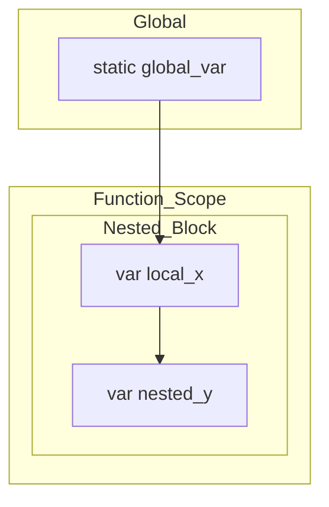

# 📝 Fiber Syntax Guide

Fiber's syntax is engineered for clarity and precision, merging a modern lexical structure with a powerful, deterministic execution engine.

## 1. Variable Ecosystem

Fiber utilizes a multi-tiered declaration system to handle memory and mutability exactly as needed.

| Keyword | Mutability | Scope | Lifetime |
| --- | --- | --- | --- |
| `var` | Mutable | Lexical | Scope-bound |
| `const` | Immutable | Lexical | Scope-bound / Compilation |
| `final` | Once-set | Lexical | Scope-bound |
| `static` | Mutable | Global | Persistent |

### The Scoping Visual


> [!TIP]
> **Lexical Scoping**: Variables are "locked" to the where they are defined. A nested function remembers its parent's variables even after the parent has finished executing (Closures).

---

## 2. Control Logic

### Conditional Branching
```fiber
if score > 90 {
    level = "A"
} elif score > 80 {
    level = "B"
} else {
    level = "C"
}
```

### Advanced Iteration
Fiber loops are strictly typed for performance:

1. **Deterministic Range**:
   ```fiber
   for i = 0 to 100 step 10 {
       print i # 0, 10, 20...
   }
   ```

2. **Collection Traversal**:
   ```fiber
   var data = [10, 20, 30]
   for val in data {
       print val * 2
   }
   ```

---

## 3. First-Class Functions

In Fiber, functions are values. They can be stored in variables, passed to other functions, and returned as results.

```fiber
# High-order function
def apply(val, func) {
    return func(val)
}

def square(n) { return n * n }

print apply(5, square) # 25
```

## 4. Native Collections

### List Literals
Ordered, dynamic arrays.
```fiber
var colors = ["red", "green", "blue"]
append(colors, "alpha")
```

### Dictionary Literals (v0.2)
Key-value mappings, critical for symbolic substitution and configuration.
```fiber
var config = {
    "ip": "127.0.0.1",
    "port": 8080,
    "active": true
}
```
