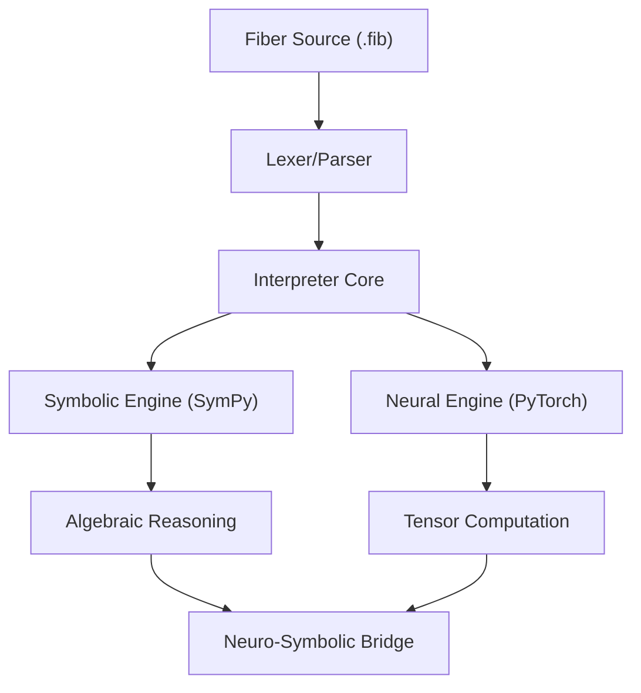

# 🌿 Fiber: High-Performance Neuro-Symbolic Language

**Fiber** is a next-generation programming language designed to bridge the gap between high-level symbolic logic and low-level numerical computation. It provides a first-class developer experience for AI researchers, data scientists, and systems engineers.

> **Status**: v0.3-beta "Standalone Mastery" 🚀

---

## ⚡ Key Features
*   **🧩 Native Neuro-Symbolic Logic**: Blend algebraic symbols (SymPy-backed) with differentiable tensors (PyTorch-backed) in the same line of code.
*   **📦 Standalone Executable**: Distributed as a single, portable `fiber.exe`. No dependency on a local Python installation.
*   **🔋 Batteries-Included**: A comprehensive standard library covering everything from SQL and DataFrames to Modular Neural Layers.
*   **🧹 Automatic Differentiation**: Built-in autograd engine for training complex neural architectures.

---

## 🚀 Quick Start (Portable Mode)

Fiber is designed to be truly portable. You don't need Python to run it.

### **Installation**
1.  Download the latest **`fiber.exe`** from the [Releases](https://github.com/Darksider70-yep/Fiber/releases) page.
2.  Place it in your project directory.
3.  (Optional) Add the folder to your system `PATH`.

### **Your First Script**
Create `hello.fib`:
```fiber
import math
from data import DataFrame

print "=== Fiber 0.3 ==="
var x = expr("x**2 + 5*x + 6")
print "Symbolic Expression: " + str(x)
print "Derivative: " + str(diff(x, "x"))
## 🚀 Quick Start

### Portable Installation (Recommended)
You don't need Python to run Fiber! 
1. Download the latest **`fiber.exe`** from the [GitHub Releases](https://github.com/Darksider70-yep/Fiber/releases).
2. Add the folder to your Windows **Environment Path**.
3. Run `fiber your_script.fib` from any terminal.

### Python Installation (Source)
If you wish to run Fiber from source:
```bash
python main-DARKZONE.py path/to/script.fib
```

---

## 🛠️ The Architecture



---

## 📚 Standard Library (LibFiber)

Fiber now ships with a production-grade standard library documented in the **[API Reference](file:///C:/Users/Daksh%20Gehlot/OneDrive/Desktop/Fiber/Documents/API_REFERENCE.md)**.

- **`math`**: Full trigonometry and advanced logs.
- **`neural`**: Modular layers (`Linear`, `Conv2D`, `Sequential`).
- **`data`**: `DataFrame` engine with sorting and cleaning.
- **`io` / `sys`**: Complete file system and OS control.
- **`sqlite` / `csv`**: High-level relational and structured data access.

---

## ❓ FAQ (Frequently Asked Questions)

### **Q: Do I need to install Python or PyTorch to run Fiber?**
**A:** No. The standalone `fiber.exe` bundles all necessary scientific libraries (including PyTorch and SymPy) into a single binary. It is completely independent.

### **Q: Can I use Fiber for production-scale Deep Learning?**
**A:** Yes! Fiber's `neural` library is built on top of high-performance C++ backends (via PyTorch). You can build, train, and save models just like you would in Python, but with Fiber's clean, symbolic-aware syntax.

### **Q: How does the "Neuro-Symbolic" part work?**
**A:** In Fiber, an object can be a `Symbolic` expression one moment and a `Tensor` the next. You can differentiate an algebraic formula and immediately use the result as the weight of a neural layer.

### **Q: Where is the Standard Library stored?**
**A:** For the standalone version, the library is embedded inside the executable. For the source version, it resides in the `lib/` directory.

---

## 📄 License
Fiber is released under the **MIT License**.
