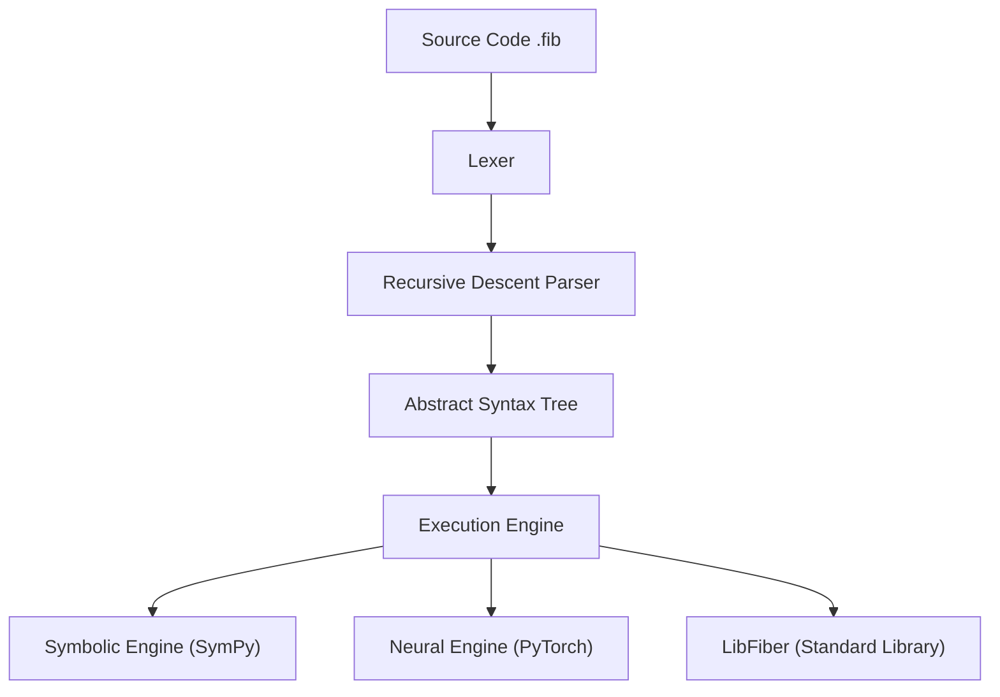

# 🌿 Fiber — A Neuro-Symbolic AI Language

[]()
[]()
[]()

> **Fiber** is a high-performance computational language engineered for **Neuro-Symbolic Reasoning**.  
> It seamlessly bridges the divide between pure algebraic math (SymPy) and high-performance neural training (PyTorch).

---

## 🏛️ Visionary Architecture

Fiber is built as a modular pipeline designed for transparency and mathematical exactness.



## 🧠 Core Philosophy
- **Reasoning-First**: Symbolic expressions are first-class citizens.
- **Deep learning Ready**: Multi-dimensional tensors with built-in autograd.
- **Optimized for Logic**: Native support for graph search and complex algorithms.

---

## 📚 Documentation Suite

Explore our in-depth guides in the `Documents/` folder:

- 🚀 [**Getting Started**](Documents/getting_started.md): Installation & first program.
- 📝 [**Syntax Guide**](Documents/syntax_guide.md): Variables, closures, and logic.
- 🧠 [**AI & Neural Engine**](Documents/ai_and_symbolic.md): Tensors, autograd, and symbolic math.
- 🏗️ [**OOP & Structs**](Documents/oop_and_structs.md): Classes, inheritance, & structs.
- 📚 [**Standard Library**](Documents/standard_library.md): Builtins, math, and graph modules.
- 🚨 [**Error Handling**](Documents/error_handling.md): Exception logic & debugging.

---

## ⚙️ Feature Matrix

| Category | Feature | Status |
|-----------|----------|--------|
| **Core** | Lexer, Parser, AST, Interpreter | ✅ |
| **Autograd** | Backpropagation, Variable Gradients | ✅ |
| **Optimization** | Managed Adam/SGD Optimizers | ✅ |
| **StdLib** | Math, Algorithms, Graph Search | ✅ |
| **Symbolic** | Derivatives, Equation Solving | ✅ |

---

## 🧪 Training Demo: Learning y = 2x + 5

```fiber
from math import PI
# Initialize learning state
var w = tensor([0.0], true)
var b = tensor([0.0], true)
var opt = optimizer([w, b], "adam", 0.5)

# Training loop
for i = 1 to 50 {
    var loss = mse_loss(w * x + b, y_target)
    opt.zero_grad()
    backward(loss)
    opt.optimize()
    print "Iteration " + str(i) + " | Loss: " + str(loss)
}
```

---

## 🧑‍💻 Author

**Daksh Gehlot**  
Developer • Researcher • Language Architect  
Building Fiber to bridge symbolic reasoning and AI computation.

---

## 🪄 License

Licensed under the **MIT License**.
